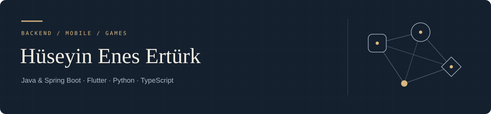

**Software engineering student · Türkiye**

I focus on Java and Spring Boot, building applications that put user experience first.

[Website & writing](https://www.huseyineneserturk.com/en) · [LinkedIn](https://www.linkedin.com/in/huseyin-enes-erturk/) · [Email](mailto:huseyineneserturk@gmail.com)

**Explore** → [Selected work](#selected-work) · [Toolkit](#toolkit) · [More projects](#more-projects) · [Website ↗](https://www.huseyineneserturk.com/en)

---

## Selected work

### 01 / Agentia

*AI agent workflows · Graduation project*

A mobile app for creating AI agents, connecting them into workflows and managing their tasks. Built with a Spring Boot API, Python workers and a Flutter client.

`Java` `Spring Boot` `Flutter` `FastAPI` `Celery` `PostgreSQL` `Redis`

[Read the project overview ↗](https://www.huseyineneserturk.com/en/projects/agentia) · Private source

### 02 / Cradlecrown

*Civilization strategy · Browser game*

A browser strategy game where players build an economy, command armies and advance through civilizations. Solo and online matches share the same TypeScript simulation.

`TypeScript` `HTML5 Canvas` `Node.js` `Socket.IO`

[Play the game ↗](https://cradlecrown.com/) · [Project overview](https://www.huseyineneserturk.com/en/projects/cradlecrown) · Private source

### 03 / StoryLucid

*Interactive reading · EdTech concept*

A concept for a children's reading app with branching stories and personalised AI content. Planned features include generated illustrations and narration using a parent's voice.

**Stage:** Concept · Private project

---

## Toolkit

| Area | Tools I use in these projects |
| :--- | :--- |
| **Backend** | Java, Spring Boot, Python, FastAPI, TypeScript, Express |
| **Mobile & web** | Flutter, React, Next.js, Astro, HTML5 Canvas |
| **Data & jobs** | PostgreSQL, Redis, Celery, MongoDB, SQLite, Firebase, Supabase |

## More projects

| Project | Work |
| :--- | :--- |
| [**Jobverse**](https://github.com/huseyineneserturk/Jobverse) | Backend developer in a team building job search, market analysis and interview practice. |
| [**CommsItumo**](https://github.com/huseyineneserturk/CommsItumo) | YouTube comment analysis with Python, FastAPI and a React dashboard. |
| [**Notest**](https://github.com/huseyineneserturk/Notest) | Developer and Scrum Master in a team building notes, summaries and Gemini-generated quizzes. |
| [**yokla**](https://github.com/huseyineneserturk/yokla) | QR attendance tracking with student, teacher and admin flows. Flutter & Firebase. |
| [**TravelCabinet**](https://github.com/huseyineneserturk/TravelCabinet) | Travel-agency bookings, sales and reporting. C#, WinForms & SQL Server. |

---

